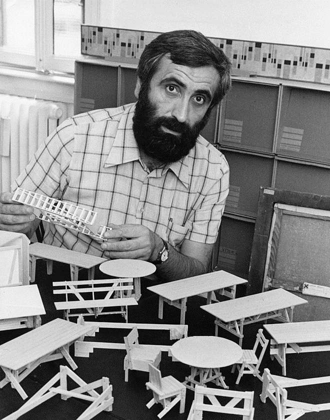

Open guide into open objects
======================

We are collectively writing the "Open guide into open objects" (Guia abierta a objetos abiertos) at Medialab Prado, Madrid. And you are welcome to write it with us.

If you want to join, please announce yourself on this page:
http://comunidad.medialab-prado.es/en/groups/open-guide-open-objects

Here is a list of pads where all the writing is happening. We have broken the subject into sections. For each section we are making statements, suggesting tools and sharing real "open source product design" examples that represent best the subject developped in the section.

**Notes**: 
 - We write using the markdown syntax.

Sections
-------------

- [Definitions]( https://mathieugabiot.titanpad.com/30 )
- [Licenses]( https://mathieugabiot.titanpad.com/31 )
- [Motivations]( https://mathieugabiot.titanpad.com/32 )
- [Distributions]( https://mathieugabiot.titanpad.com/33 )
- [Economics]( https://mathieugabiot.titanpad.com/34 ) 
- [Design processes]( https://mathieugabiot.titanpad.com/35 ) 
- [Meta/Links]( https://mathieugabiot.titanpad.com/39 )

Production schedule
-----------------------------

We mainly work from 10:00 to 20:00 CET (Madrid).

 - From the 4th of December to the 9th: writing
 - From the 10th of December to the 14th: layout / illustrations
 - 15th and 16th of December: printing and exhibition

Title of the book
-----------------------
Propositions for the title of the book.

- Open Guide into Open Objects
- Where is your FUCKING Licence?
- WHY a Licence for Object? or WHY a Licence for Open Object?
- Steps into Open Source Product Design
- Freedom for objects
- I have no idea what I'm doing but I call it open source product design
- Product design that does not suck
- What The Fuck Product Design

Authors
-----------

- Mathieu Gabiot
- Martin Léveque
- Gaizka Altuna
- Julien Deswaef

License
-----------
[Free Art License 1.3](http://artlibre.org/licence/lal/en/ )

Howto
--------

Link an image example

