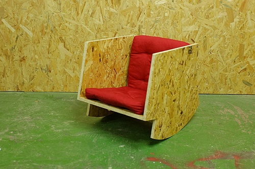
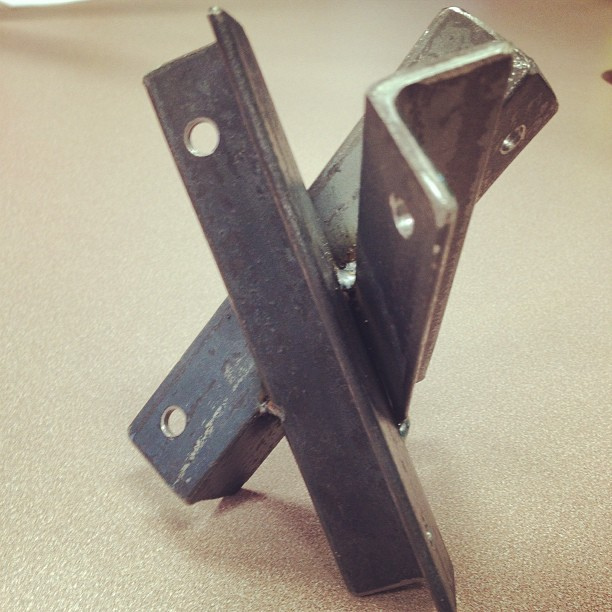
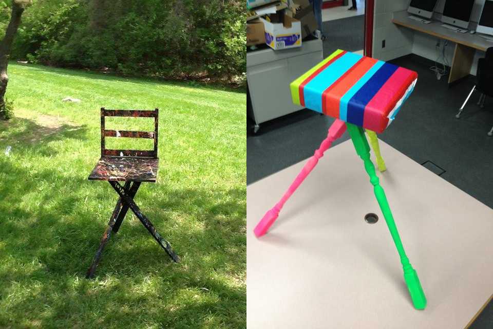
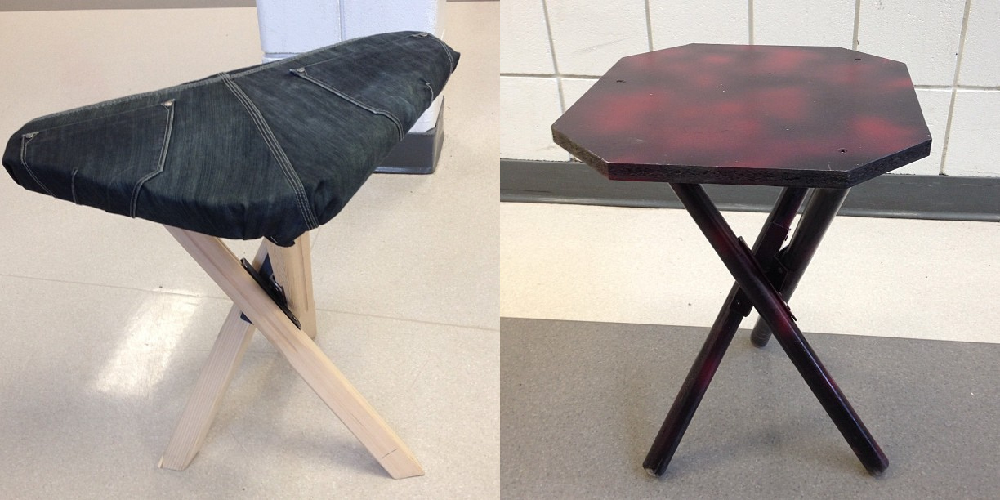
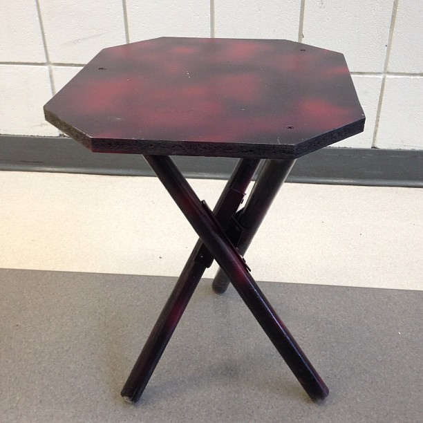
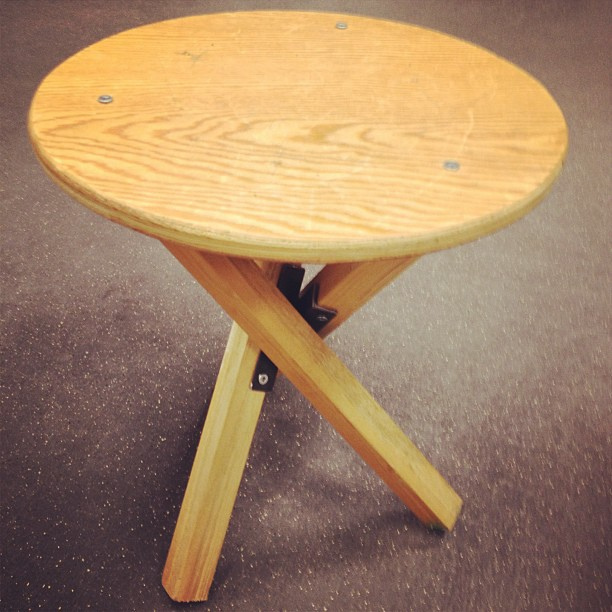

Design as a process
===============

##Skills

Often design requires extensive knowledge in many fields and a lot of skills, both intellectual and manual. Skills like fine tridimensional sense, knowledge in geometry and mathematics or experiences with 2d or 3d software would help you a lot at the time of beginning your design. But do not be afraid if you think that you have not enough skills, because almost all the people can design objects. Remember the times in which you used to buid huts,  homemade bows or models made by toys like Lego. In addition, working with open source designs makes designing easier as you can do not start from the scrach.

##Ways of working

Do not only use computer but also work with your hand. Experimentation is an important part in design process, it is about trying, testing, go further, making mockup to validate physically your initial idea is essential

 ## Concept / modelise (Drawing/Representation Tools?)

There are multiple tools you can use for drawing or representing your designs, from analogical traditional tools like pencil, pens, watercolours or handmade models to digital tools like vectorial drawing applications or 3D digital enviroments for moddeling. Analogical tools, of course, are useful but in order to share design efectively and fabricate them in a fast and precise way we use digital tools or software of drawing and representation.

This digital software could be proprietary or opensource. If you use proprietary software to create your designs its does not mean that your design is not open source. However, we recommend to be consistent in your design processes. Using free/libre open source software helps making your process as well as design open.

In the following pages, we will talk about diferent digital tools that you can use for your designs. Do not forget that this are not all the options you can use, only a few ones.

 
## Design Tactics
###Not Starting From Scratch
 
  "*If I have seen further than others, it is by standing upon the shoulders of giants.*" Isaac Newton

Sometime when you are begin with the design of an object your are going to find yourself face to face to with a empty white sheet of paper. But if you work with object with open source licences you will be able to implement some designing tactics that allows you to begin working from the work of others designer, instead start from scratch. At the same time, if you licence your design you will allow other designers to use your design, this way your design can stay alive, constantly improving and changing. In the following pages we are going to tell you some of the designing tactics that open source tactics allows you.

#### Modifing
*To make partial changes to.* [Wiktionary](https://en.wiktionary.org/wiki/open_source)

When an object has been licenced by certain type of permisions its allows you to make changes in its design. There are many points of the object can be modified: color,  shape, texture, materials, form, functionality. Is also posible to add or remove elements.

#### Adapting
 *To make suitable; to make to correspond; to fit or suit; to proportion.* [Wiktionary](https://en.wiktionary.org/wiki/adapt)
 
One of the advantages of the open source object is that you are able to adapt them to your own needs (or anyone elses needs). There could be diferent reasons for adapting an object. Sometimes the reasons for adapting a design could be personal (Size, proportion, taste...). Other times the reasons for implement an adaptation are related to the fisical context (Climate, scale, materials abailable), technological context (technical knowledge and context available) or social context (language, religion, tradition, icons..)

####Parametric design:

A possible solution to make easiest modification on a object is parametric design, but that means you should learn about it before.
- Parametric design *is a paradigm in design where the relationship between elements are used  to manipulate and inform the design of complex geometries and  structures.* https://en.wikipedia.org/wiki/Parametric_design

#### Mixing
 *To combine items from two or more sources normally kept separate.* [Wiktionary](https://en.wiktionary.org/wiki/mix)
 
Another advantage of the open source objects is that they can be combined. You could take two (or more) open source elements and mix them in order to create a new object. This can be a way fast way of create usefull new object.
 
 
#### Copying
 
*To produce an object identical to a given object.*
 
Some licences allows you to copy objects. This not only allows you to copy an object for its use or for distributing it, its also enables you to use the multiple copies of this object for reaching a bigger achievements. For example you can copy an open source single ball for playing with it, or you can copy it a million of times and make a ballpool.

#### Forking

 The “fork” means an object having a common root with a second one. Initially twins, these two objects will separate and follow their own developments.
 
##### Examples of Workshop 2015 *divreved objetcs* by Libreobjet

 

#### Upcycling
Upcycling is the process of transforming by-products, waste materials, useless  and/or unwanted products into new materials or products of better quality or for better environmental value.

 
##### Examples of pallets, welcomemamy Martin?

### Physical production
Since the very first industrial manufacture machine "the spinnig jenny" the human being has been looking for improving the automatic fabrication processes  in order to reach faster and more precise results. Thanks to the digital revolution that started in the middle of the previous century, nowadays we can program machines by computer to fabricate tangible object by defining them digitally. At first, this kind of technology was only available to professional industry, but in the last decades a democratization process of these technologies has started, making them accessible for everybody.

Some of this tools has been reduced in size, dirtiness and noisiness, so has became, somehow, lets say, domestic. In other cases, the tools are still being  big, dirty and/or noisy, but there has appear a new kind of spaces in our cities that makes them accesible to the non professional people, like, for example, the fablabs. In the following lines we will explain different tools of digital fabrication that you can use for fabricating open source designs that has been defined digitally.

#### Materials

There are many types of materials that could be used for creating objects and on the same time there are many criteria to choose them. However, there are some properties on which you should think at the time of choosing the materials of the open source object you are designing.

An open source design should be fabricated anywhere by anyone or at least in the greatest amount of places that is posible and by the greatest amout of people that is posible. For that reason at the time of choosing materials we recomendate to use materials that could be got easily anywhere by anyone.

Economic factor is also important. If you choose an extended material but it is expensive, only a few people will be able to build your design. Bu not only economic cuestions are important, you also should consider the ecologic. There are a lot of material that you can recycle, or even better, upcycle. For example emterials like pallets are easy to find anywhere, by anyone, for free.

Finally you also have to consider the tools that you need to work with the materials you are going to fabricate your model. For example, glass and methacrylate are easy to find but while methacrylate could be easily cut by a common cutter, for cutting glass the tools are not as common and the technics are not as simple.

Tools
---------

For each type of task you need to do you would find diferent tools offered. It is important to find the tools that best suits for your designs, not only technically but also ethically. That is why encourage you to use open source tools for making your open source designs. If you use, for example a proprietary software for doing an open source design, as we have said before, it does not mean that your design is not open source. But if you use an open source tool you will ensure that anyone can work on your design without needing to pay the fees for the proprietary software. In addition, you are going to be ethicaly more coherent, which is as important as the openess of the tools used.

On the following lines we will introduce you some open source applications that you can use for designing.

#### Software Opensource for designing objects DAO/CAO
- Librecad: LibreCAD is a free Open Source CAD application for Windows, Apple and Linux. Support and documentation is free from our large, dedicated community of users, contributors and developers. 
advantage: close to autocad
disadvantage: 

- Freecad: FreeCAD is a parametric 3D modeler made primarily to design real-life objects of any size. Parametric modelingallows you to easily modify your design by going back into your model history and changing its parameters. FreeCAD is open-source and highly customizable, scriptable and extensible.
FreeCAD is multiplatfom (Windows, Mac and Linux), and reads and writes many open file formats such as STEP, IGES, STL, SVG, DXF, OBJ, IFC, DAE and many others.
advantage: parametric, graphic aided user interface
disadvantage: hard development, not stable

- opencad: OpenSCAD is a software for creating solid 3D CAD models. It is free software and available for Linux/UNIX, Windows and Mac OS X. Unlike most free software for creating 3D models (such as Blender) it does not focus on the artistic aspects of 3D modelling but instead on the CAD aspects. Thus it might be the application you are looking for when you are planning to create 3D models of machine parts but pretty sure is not what you are looking for when you are more interested in creating computer-animated movies.
advantage:
disadvantage: 

- Blender: Blender is the free and open source 3D creation suite. It supports the entirety of the 3D pipeline—modeling, rigging, animation, simulation, rendering, compositing and motion tracking, even video editing and game creation. Advanced users employ Blender’s API for Python scripting to customize the application and write specialized tools; often these are included in Blender’s future releases. Blender is well suited to individuals and small studios who benefit from its unified pipeline and responsive development process.
Blender is cross-platform and runs equally well on Linux, Windows and Macintosh computers. Its interface uses OpenGL to provide a consistent experience.
advantage: multi-platform, really stable, light, huge community, updated often, lot of tutorials, documentation
disadvantage: complex, 3d abstract appraoch

- inskape: Inkscape is an open-source vector graphics editor similar to Adobe Illustrator, Corel Draw, Freehand, or Xara X. What sets Inkscape apart is its use of Scalable Vector Graphics (SVG), an open XML-based W3C standard, as the native format.
advantage: multi-platform, easy to use, really stable, light, large community, updated, lot of tutorials, documentation
disadvantage: CMYK output (in progress)

[image source](https://www.flickr.com/photos/eager/13614572614/in/photolist-qifQQT-qzwM1c-qihunx-pCWgpH-qi8Rrq-qxqnCu-qihu1k-qzCG61-qxqnzJ-qi9xM7-qihsNR-qi8R65-qihsXP-pCWhBc-pCGUk5-qihttZ-qzwN9K-qxqmRj-qi8S11-mK3tGM-mK3rER-mK3urF-mK3t42-mK5h2Y-mK3pQ8-mK5f7A-mK5dUL-mK5d4Y-mK3wpD-mK5iFu-mK3wmz-mK3yJ8-mK5hrq-dxzXMu-9UVoLE-aoH6tk-aoH6hV-aoH6nZ-aoKQrS-5AhkAm-ncuMtD-nUkGJM-5AhkA3-5AhkAd-5AhkzW-5AhkAj-pedNPo-6yUh2E-a1FL3k-7LyVWw )

- Vector graphics:
*is the use of geometrical primitives such as points, lines, curves, and shapes or polygons—all of which are based on mathematical expressions—to represent images in computer graphics.  Vector graphics are based on vectors (also called paths), which lead  through locations called control points or nodes. Each of these points  has a definite position on the x and y axes of the work plane and  determines the direction of the path; further, each path may be assigned  a stroke color, shape, thickness, and fill. These properties don't  increase the size of vector graphics files in a substantial manner, as  all information resides in the document's structure, which describes  solely how the vector should be drawn.* https://en.wikipedia.org/wiki/Vector_graphics#Standards

#### Digital Tools for fabrication

**CNC router: **

 

*"A CNC router is a computer controlled cutting machine related to the hand held router used for cutting various hard materials, such as wood, composites, aluminium, steel, plastics, and foams. CNC stands for computer numerical control. CNC routers can perform the tasks of many carpentry shop machines such as the panel saw, the spindle moulder, and the boring machine. They can also cut mortises and tenons.
A CNC router is very similar in concept to a CNC milling machine. Instead of routing by hand, tool paths are controlled via computer numerical control. The CNC router is one of many kinds of tools that have CNC variants.
A CNC router typically produces consistent and high-quality work and  improves factory productivity. Unlike a jig router, the CNC router can  produce a one-off as effectively as repeated identical production.  Automation and precision are the key benefits of cnc router tables."*

*"CNC routers come in many configurations, from small home-style D.I.Y.  "desktop" like k2 cnc, to large industrialCNC routers used in sign  shops, cabinet making, aerospace and boat-making facilities"* 

*"CNC routers are generally available in 3-axis and 5-axis CNC formats.  Many Manufacturers offer A and B Axis for full 5 Axis capabilities and  rotary 4th axis"*

[Wikipedia](https://en.wikipedia.org/wiki/CNC_router)

**Laser cutter**
*"Laser cutting is a technology that uses a laser to cut materials, and is typically used for industrial manufacturing applications, but is also starting to be used by schools, small businesses, and hobbyists. Laser cutting works by directing the output of a high-power laser most commonly through optics. The laser optics and CNC (computer numerical control) are used to direct the material or the laser beam generated. A typical commercial laser for cutting materials would involve a motion control system to follow a CNC or G-code of the pattern to be cut onto the material. The focused laser beam is directed at the material, which then either melts, burns, vaporizes away, or is blown away by a jet of gas,[1] leaving an edge with a high-quality surface finish. Industrial laser cutters are used to cut flat-sheet material as well as structural and piping materials."*
[Wikipedia](https://en.wikipedia.org/wiki/Laser_cutting)

**3D printing**

 

*"3D printing, also known as additive manufacturing (AM), refers to various processes used to synthesize a three-dimensional object. In 3D printing, successive layers of material are formed under computer control to create an object. These objects can be of almost any shape or geometry, and are produced from a 3D model or other electronic data source."*

*"3D printing in the term's original sense  refers to processes that sequentially deposit material onto a powder  bed with inkjet printer heads. More recently, the meaning of the term  has expanded to encompass a wider variety of techniques such as extrusion and sintering-based processes. Technical standards generally use the term additive manufacturing for this broader sense."*

[Wikipedia](https://en.wikipedia.org/wiki/3D_printing)

**Make your own tools**
Improving your tools by yourself or making your DIY tools for doing you DIY design is another option. In the traditional woodworking this was a very common practice. Nowadays there are a lot of people that make their own tools or improving their own tools. For example the conversions of milling hand routers into a CNC routers or the fabrication of 3D printers.

#### Collaborative tools

**Git**

 

"* Git (/ɡɪt/[4]) is a widely used version control system for software development.[5] It is a distributed revision control system with an emphasis on speed,[6] data integrity,[7] and support for distributed, non-linear workflows.[8] Git was initially designed and developed by Linus Torvalds for Linux kernel development in 2005.
As with most other distributed version control systems, and unlike most client–server systems, every Git working directory is a full-fledged repository with complete history and full version-tracking capabilities, independent of network access or a central server.[9] Like the Linux kernel, Git is free software distributed under the terms of the GNU General Public License version 2.*" [Wikipedia](https://en.wikipedia.org/wiki/Git_%28software%29)

References
-----------------

Upcyclist by Antonia Edward
[Upcyclist](http://www.randomhouse.de/book/Upcyclist-Reclaimed-and-Remade-Furniture-Lighting-and-Interiors/Antonia-Edwards/e423253.rhd?pub=58500)

Objects
---------------

#####Bouctje become Reeboek

!

[Bouctje](http://libreobjet.org/objects/bouctje/ ) is a bookshelf designed by Mathieu Gabiot on january 2013 and licenced with a Free Art Licence. [Reeboek](http://libreobjet.org/objects/reeboek/ ) is derived design of Bouctje made by Verly Laurent on september 2013 also licenced with a Free Art Licence. This is a good example about the advantages of the open source objects. Thanks to the open licence of Bouctje, its design could be modified,  its scale and functionality were changed, and a new object with a new propouse born.

#####Wikiseat

"*WikiSeat is an open source furniture project. That means  that all of the documentation for how to build a WikiSeat is freely and  openly published online.
At the heart of each WikiSeat is a Catalyst. This is the  structural support, made out of welded angle iron, that helps hold three  legs in place. The seat part goes on top. It is a pretty simple idea,  but there are no instructions for how to assemble these parts. We  encourage people to find materials rather than buying them from a  store. Every WikiSeat is a truly unique creation, a reflection of the  creators environment and ideas.*"
[Wikiseat](http://www.wikiseat.org/about/)

Open questions
----------------------

Do you think that the open source licenses became designing easier for no professional people? 

Do you think that the open source licenses make designing more democratic?

Do you prefer starting from scratch or from existing design?

