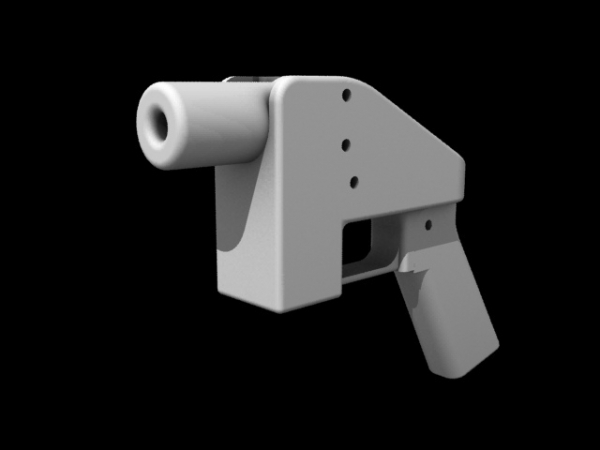

Distribution
========

**Distribution** is one of the key feature of open source product design. This is the main reason we attach an open license to an object, to encourage its dissemination. Distribution is not only bringing a manufactured object from its production facility to the final user, it is also a feature of the object, a communication process, a dialogue between the designers, the builders and the users. In open source product design, distribution is the second step a creator has to take after choosing a license and will mostly be the continuous step that will prevail through the design's life.

**Distribution** has to be thought from 2 interacting point of views:
 - The physical
 - The dialogue
 
The physical
------------------
**How is your object physically distributed?**

As mentioned in the "Motivations" section, one of the benefits of open source product design is that the documentation can travel faster using contemporary communication tools than shipping an object in a container. This then potentially seperates even more the places where the objects are imagined from places where objects are built. It' is already the case when design is done in western countries for a western market and the resulting objects are produced in countries with cheap labor. But with open source product design, this relationship can be totally broken as objects could potentially be designed anywhere and fabricated where they are demanded. At least, this is where we do see the benefits of it. Of course, this particular relation could be "closed" again if only specific skills and tools that are required to design and produce the objects.

Another benefit of digital distribution of the documentation is when certain objects can't be found in certain parts of the world due to legal restrictions. Digital fabrication tools such as a 3D printer have changed the way we look at certain objects and opened the doors to "illegal objects" manufacturing. 

### Distributing physical open source object

Something that is quite easier to figure with software is if the software itself is open source. This is normally clearly indicated in the software itself. But with objets, this can be tricky. How can I know that the object I'm using is opensource?

> refer to a license or a sign somewhere on the object.
>  marking by engraving, laser, sticker, the license name or an url where  you can find further informations about this objects (license,  sources...)
Why?
because  if it is only on separate sheet/document or packaging, this information  can be lost if the user/buyer decide to give this object to other. New  user can have no idea about the origin and loose the oportunity of what  open source can give it him (adapt, remix, etc...)
This  thing is still an issue about the complexity to add information on a  object (small object, smooth materials...). We are still looking for new  ideas.
 
The dialogue
------------------
**How open is your conversation?**

The dialogue between a designer and any other person involved in the project will be done through **the documentation**. If you don't document your project, nobody will be able to interact with it in a constructive manner. If we could again make a comparison with software, if you don't distribute the source code in a readable manner, if you only distribute binary files, it can not be open source software. Same thing with objects, the full documentation is a requirement for open source product design.

By documentation, we mean all the all the documents one will need to copy and modify the product easily.

Documentation can take many form. It could be sound, video, schemas, 3D files, 2D files, scanned drawings, etc. We don't see were one type or the other should be excluded as long as it is the most suitable format for documenting the project. But documentation has to always be published under an open source license and be available in an open standard.

Documentation is often overlooked by designers. And many project fall short on being called open source product design because of their lack of or poor docunentation. A rule of thumb when making a project is to consider that documentation will take at least 50% of the time.

Documentation
----------------------

Here are a list of things you should consider when documentating objects. This list is based on requirements we've made for adding objects to the collection of [Libre Objet](http://libreobjet.org ) :
- general view (picture or drawing) of your object
- general size (L x H x D) in mm or cm or inches
- general standard views (front, left/right side, up/down)
- list of all materials used in the composition of your object
- list of tools required to build the object
- date of creation
- name of designer(s) and any other authors
- name of builder
- full license text (FAL, CC, CERN...)
- url(s) of sources (if available)
- description of each part, like technical drawing with size, scale, front
- description for the assembly, the order/way to mount (drawings, pictures, better than text but why not)
- description of potential issues or different way to improve the project after (see Entropie's Doc http://www.asso-entropie.fr/media/filer_public/cd/37/cd37e323-1f8c-450e-8cbc-0fe9a12f95bb/table_et_banc_entropie_juillet2013.pdf)
- ways of using the object

### How deep is your source?
- documentation + license + 3d/2d files 
For example, Entropie don't share digital files, only pdf. Not so easy to remix or fork their design before the step of making...But they do it in this case (http://www.asso-entropie.fr/fr/design-libre/atelier/documents/ )but you don't have documentation...

### Where to publish your designs?

There is many ways you can distribute your designs. But we strongly encourage that you manage distribution yourself, from your own little corner of the interent or that at least you don't rely on one channel for distribution, especially if that channel is a big corporation who only cares about collecting data from its visitors. 

We do recommend though that you build your distribution channels the same way you build the objets themselves, collectively. You will find online collectives that will be happy to spread your design and engage in a conversation with you about it.

Open file formats
------------------------

Talking about the reason about 

Tools
-------
 - hosting platforms
 - Instruction manuals / schemas
 - Open standards
 - file sharing
 - upload / Download
 - wikis
 - Fablabs/Makerspaces
 - Local manufacturer
- distributed versioning
- **Teaching / Education** is a good way to share projects and ideas.

Objects
-----------

### Dobsonian Telescope

 

> *John Lowry Dobson (September 14, 1915 – January 15, 2014) was an amateur astronomer and is best known for the Dobsonian telescope, a portable, low-cost Newtonian reflector telescope.* [Wikipedia](https://en.wikipedia.org/wiki/John_Dobson_%28amateur_astronomer%29 )

The dobsonian telescope is a telescope designed for amateur astronomy. It was created in 1950 by the amateur astronomer John Dobson and we could say that it is a open source object, although the terms open source and the open source licenses did not exist at all at that time. It is easily buildable at home using cheap and common materials, and its construction does not require any special ability, and even if there are commercial models, they are modified and customized by their users. This facts encourage the constant redefining of the design of this telescope every time it is built.

This model of telescope has been distributed widely around the world and nowadays is the most used by the amateur astronomists. Thanks to the dobsonian telescope amateurs, there have done a lot of discoveries by amateur observers, like the Comet  Hale-Boop, discovered by Tom Boop on 1995.

In the text *The Pro-Am Revolution: How enthusiasts are changing our economy and society* Charles Leadbeater and Paul Miller explain how thanks to the dobsonian telescope nowadays exists a symbiosis between professional astronomers and amateur astronomers. Thank to its openess the dobsonian telescope had been improved to a point that makes almost as powerfull as a professional telescopes from the observatories, so when the data that professional astronomers get in the observation stations they make a call to the networked amateur observers who provide them with fantastic information.

Thanks to the open distribution of the dobsonian telescope the science can advance a little bit faster. When the astronomer Bob Alborzian encouraged Dobson to patent the dobsonian telescope, he just said "These are gifts to humanity". 

http://spontaneousgenerations.library.utoronto.ca/index.php/SpontaneousGenerations/article/viewFile/11947/11185

http://www.demos.co.uk/files/proamrevolutionfinal.pdf

### Liberator 

 

 

On the last years one of the most polemical issue relative to the open source object and its distribution has been the printed weapons. Especially It has been highly publicized case The Liberator single shot  gun.

> *The  Liberator is a physible, 3D-printable single shot handgun, the first such printable firearm design made widely available online. The open source firm Defense Distributed  designed the gun and released the plans on the Internet on May 6, 2013. The plans were downloaded over 100,000  times in the two days before the US Department of State demanded that Defense Distributed retract the plans.
The  plans for the gun remain hosted across the Internet and are available at file sharing websites like The Pirate Bay.* [Wikipedia] (https://en.wikipedia.org/wiki/Liberator_%28gun%29)

The Liberator Gun was a really polemic case. It does not only create  discusions about the ethics of what could be built using the new domestic 3D printers but also about the distribution of the blueprints and instructions of the objects and artifacts that could be printed.

The  controversy created by the Liberator shows the potential of the open source designs to be distributed around the world regardless the frontiers, customs or any kind of territorial law.

http://peerproduction.net/issues/issue-6-disruption-and-the-law/peer-reviewed-articles/regulating-the-liberator-prospects-for-the-regulation-of-3d-printing/

### Readymake: Duchamp Chess Set

Readymake: Duchamp Chess Set is a printable chess set based on a chess set that the dadaist artist Marcel Duchamp designed for himself. This printable set of pieces was made by Scott Kildall and Bryan Cera and they shared it on Thingiverse on the April 21st , 2014. On the September 17th, 2014 they received a letter warning that they were infringing the intelectual property of Marcel Duchamp. After asking different lawyers and making a research about their possibilities, they've decided to remove the Duchamp Chess Set from the repository and have asked everyone else to do so.

This is an example of how the open source design can be censored and pursued. If 
you want to know more about this case you can read the full story at the following link.

http://kildall.com/what-happened-to-the-readymake-duchamp-chess-pieces/

References
----------------
Some existing platforms to distribute your content:

- http://ibreobjet.org is the online collection of open source product design from the eponym collective. They're open to submissions if you follow some rules regarding the documention of your project.
- http://gitlab.org is a code hosting plateform dedicated to open source collaboration, but they could also work as a repository for open source designs.
- http://www.opendesk.cc/ will accept submissions of open designs that can be produced through digital fabrication mechanisms typically found in fablabs.

Open questions
----------------------
- How can you make your object integrate in its design the license and documentation necessary to make it?
- How can you tell the user that the object s/he is using is open source?
- What could be an object that distribute itself?

