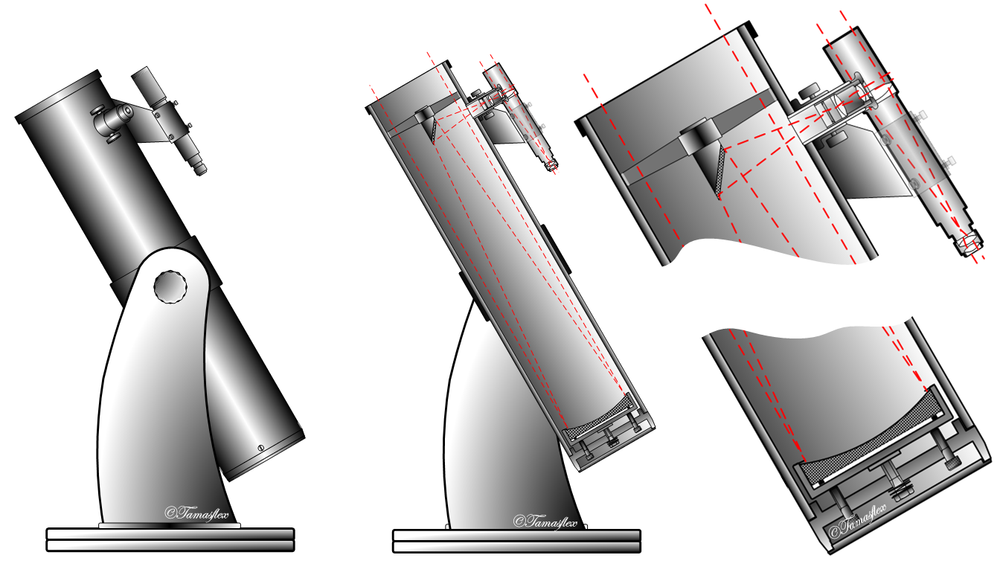

Distribution
========

**Distribution** is one of the key feature of open source product design. This is the main reason we attach an open license to an object: to encourage its dissemination. Distribution is not only bringing a manufactured object from its production facility to the final user, it is also a feature of the object, a communication process, a dialogue between the designers, the builders and the users. In open source product design, distribution is the second step a creator has to take after choosing a license and will mostly be the continuous step that will persist through the design's life.

**Distribution** has to be thought of from two interacting point of views:
 - The physical
 - The dialogue

The physical
------------------
**How is your object physically distributed?**

As we mentioned in the Motivations section, one of the benefits of open source product design is that documentation can travel faster using contemporary communication tools than can an object shipped in a container. This then potentially separates even more the places where objects are imagined from the places where objects are built. It is already the case when design is done in western countries for a western market and the resulting objects are produced in non-western countries with cheaper labor. But with open source product design, this relationship can be totally broken as objects could potentially be designed anywhere and fabricated where they are demanded. At least, this is where we do see the benefits of it. Of course, this particular relation could be "closed" again if only specific skills and tools are required to design and produce the objects.

Another benefit of digital distribution of documentation is when certain objects can't be found in certain parts of the world due to legal restrictions. Digital fabrication tools such as a 3D printer have changed the way we look at certain objects and opened the doors to the manufacture of "illegal objects".

### Distributing physical open source objects

Something that is quite easy to figure out with software is if the software itself is open source. This is normally clearly indicated in the software itself. But with objets, this can be tricky. How can I know that the object I'm using is open source?

There might be ways to expose this with a proper marking or tagging on the object. Engraving or sticking a mention of the license and a url where to find further information about the object could be an elegant solution in some cases. Or maybe one day, design lovers will be able to recognize an open source object just by looking at it. But until then, this should be something to think about when designing open source products.

Communicating the product's license directly on the product somehow is important. If the license is only mentioned on separate documents or packaging, it can be lost if the user decides to give the object away. The new users will then have no idea about the origin and lose the opportunity to know the benefits of the object and its license -- adapt, remix, etc.

The dialogue
------------------
**How open is your conversation?**

The dialogue between a designer and any other person involved in the project will be done through the **documentation**. If you don't document your project, nobody will be able to interact with it in a constructive manner. If we could again make a comparison with software, if you don't distribute the source code in a readable manner, if you only distribute binary files, it cannot be open source software. It's the same thing with objects. The full documentation is a requirement for open source product design.

By documentation, we mean all the documents one will need to copy and modify the product easily.

Documentation can take many forms. It could be sound, video, schema, 3D files, 2D files, scanned drawings, etc. We don't see any reason why one type or other should be excluded as long as it is the most suitable format for documenting the project. But documentation has to always be published under an open source license and be available in an open standard.

Documentation is often overlooked by designers. And many projects fall short of being called open source product design because of their poor or missing documentation. A rule of thumb when making a project is to consider that documentation will take at least 50% of the time.

And this should be done as soon as the project starts.

Documentation
----------------------

Here are a list of things you should consider when documentating objects. This list is based on requirements we've made for adding objects to the [Libre Objet](http://libreobjet.org ).
- General view (picture or drawing) of your object
- General size (L x H x D) in m, cm mm or inches
- General standard views (front, left/right side, up/down)
- List of all materials used in the composition of your object
- List of tools required to build the object
- Date of creation
- Name of the designer(s) and any other authors involved
- Name of builder(s)
- Full license text (FAL, CC, CERN...)
- URL(s) of original sources
- Description of each part, like technical drawing with size, scale, front
- Description of the assembly, the order and way to mount it (drawings and pictures are better than only text)
- Description of potential issues or possible ways to improve the project (see Entropie's doc http://www.asso-entropie.fr/media/filer_public/cd/37/cd37e323-1f8c-450e-8cbc-0fe9a12f95bb/table_et_banc_entropie_juillet2013.pdf)
- Ways of using the object

### How deep is your source?
Be generous with the documentation. Share everything. Digital files are cheap anyway. And if you need to render or compile the documentation to be readable, share also the source files for the documentation. This is required if you want other designers to make adaptations.

### Where to publish your designs?

There are many ways you can distribute your designs. But we strongly encourage that you manage distribution yourself, from your own little corner of the internet or that at least you don't rely on one channel for distribution, especially if that channel is owned by a big corporation which only cares about collecting data from its visitors.

We do recommend that you build your distribution channels the same way you build the objects themselves: collectively. You will find online collectives that will be happy to spread your design and engage in a conversation with you about it.

Open formats
-------------------

Documentation being a key element, it would do no good for the object and its reach if it required a proprietary application to be accessed.

Open formats are usually standards to store information that can be readable by a human or a machine and of which the specification is publicly available, fully described and exempt of patents and copyright.

Open formats are the only way to garantee a future to your design documents. Any other format would be bound to the willingness of their maintainers to continue to support it. You would not want your life's work to become inaccessible because some company, somewhere, went bankrupt or changed their business model and decided not to support this or that particular feature.

And don't think that the size, popularity or apparent financial wellness of a company is a guarantee of anything.

Tools
-------

### Distribution platforms
- http://ibreobjet.org  is the online collection of open source product design from the eponymous  collective. We're open to submissions if you follow some rules regarding the documention of your project. The source code for the website is also available as open source. So you could just copy our source and use it to build your own collection of projects.
- http://gitlab.org is a code hosting platform dedicated to open source collaboration, but they could also work as a repository for open source designs. The source code of Gitlab is also availalbe, so you can install it on your owr server.
- http://el-recetario.net/ is a collection of upcycling projects and their recepies. They allow anyone to publish projects under CC licenses. The website is built with Wordpress, a popular open source content management system and could serve as a good example of a distribution plateform built with these tools.

### Open formats
It would be foolish to list here all the open formats available, some being more popular than others, and new formats being created all the time, but here is a short selection:
  - SVG (Scalable Vector Graphics) for vector graphic files
  - PNG (Portable Network Graphics), is a standard lossless compression format for raster images
  - STL (STereoLithography), a standard format for sharing 3D files, usually associated with 3D printing.
  - OBJ is an open 3D file format and the _de facto_ standard for exchanging files between 3d applications.
  - PDF (Portable Document Format) is a widely used standard to present documents.

### Distributed versioning
Git and Mercurial are two distributed source control programs that work similarly. They provide tools such as the versioning of files which have helped coders work together on large projects. These kinds of tools, although more adapted to managing text, should be considered and integrated more and more in a designer's workflow.

### Physical distribution
Visit your local fablabs, makerspaces, hackerspaces, micro-factories, local community manufacturers and share your creations. They usually gather large groups of people that could help you distribute your projects further.

Objects
-----------

### Dobsonian Telescope

 

> John Lowry Dobson (September 14, 1915 – January 15, 2014) was an amateur astronomer and is best known for the Dobsonian telescope, a portable, low-cost Newtonian reflector telescope.  
−[Wikipedia](https://en.wikipedia.org/wiki/John_Dobson_%28amateur_astronomer%29 )

The dobsonian telescope is a telescope designed for amateur astronomy. It was created in 1950 by the amateur astronomer John Dobson and we could say that it is an open source object, although the terms open source and the open source licenses did not exist at all at that time. It is easily buildable at home using cheap and common materials, and its construction does not require any special ability. Even if there is commercial models available, they are usually modified and customized by their users. These facts encourage the constant refining of the design of the telescope every time it is built.

### The Liberator

 

 

During the last few years, one of the most polemical issue relative to open source object and their distribution has been 3D-printed weapons, and especially the highly publicized case of the Liberator single shot gun.

> The Liberator is a physible, 3D-printable single shot handgun, the first such printable firearm design made widely available online. The open source firm Defense Distributed  designed the gun and released the plans on the Internet on May 6, 2013. The plans were downloaded over 100,000  times in the two days before the US Department of State demanded that Defense Distributed retract the plans.  
The plans for the gun remain hosted across the Internet and are available at file sharing websites like The Pirate Bay.  
−[Wikipedia] (https://en.wikipedia.org/wiki/Liberator_%28gun%29)

The Liberator Gun was a really polemic case. It not only created discussions about the ethics of what could be built using the new domestic 3D printers but also about the distribution of the blueprints and instructions of the objects and artifacts that could be printed.

The  controversy created by the Liberator shows the potential of the open source product design being distributed around the world regardless of borders, customs or any kind of territorial law.

http://peerproduction.net/issues/issue-6-disruption-and-the-law/peer-reviewed-articles/regulating-the-liberator-prospects-for-the-regulation-of-3d-printing/

### Readymake: Duchamp Chess Set

Readymake: Duchamp Chess Set is a printable chess set based on the version Dadaist artist Marcel Duchamp designed for himself. This printable set of pieces was made by Scott Kildall and Bryan Cera and they shared it on Thingiverse on April 21st, 2014. On September 17th, 2014 they received a letter warning them they were infringing the intellectual property held by the estate of Marcel Duchamp. After asking different lawyers and researching possibile responses, they decided to remove the Duchamp Chess Set from the repository and have asked everyone else to do so.

This is an example of how the open source product design can be censored.
http://kildall.com/what-happened-to-the-readymake-duchamp-chess-pieces/

Food for thought
------------------------

### Dobsonian Telescope Amateurs

This model of telescope has been distributed widely around the world and is now the most used by the amateur astronomists. Thanks to the network of Dobsonian telescope owners, there have been many discoveries made by amateur observers, like the Comet  Hale-Bopp, discovered by Alan Hale and Thomas Bopp in 1995.

In the text *The Pro-Am Revolution: How enthusiasts are changing our economy and society*  Charles Leadbeater and Paul Miller explain how, thanks to the Dobsonian telescope, there is now a symbiosis between professional astronomers and amateur astronomers. Thanks to its openness, the Dobsonian telescope has been improved to a point that makes it almost as powerful as a professional telescope.

Thanks  to the open distribution of the Dobsonian telescope, science can advance a little bit faster. When the astronomer Bob Alborzian  encouraged Dobson to patent the telescope, Dobson replied "These  are gifts to humanity".

http://spontaneousgenerations.library.utoronto.ca/index.php/SpontaneousGenerations/article/viewFile/11947/11185

http://www.demos.co.uk/files/proamrevolutionfinal.pdf

### Other platforms:

- http://www.opendesk.cc/ will accept submissions of open designs that can be produced through digital fabrication mechanisms typically found in fablabs.

- http://thepiratebay.se is a popular online index of torrent files, usually associated with the mass distribution of copyrighted entertainment material

### Entropie
Entropie has published many open source product designs, such as this [_Carriole à Vélo_](http://www.asso-entropie.fr/fr/design-libre/notices/carriole-velo/ ) (bike trailer) for example. But they only share the documentation in a single pdf, no other sources attached, complicating and putting a brake on the adaptation prossiblities.

Open questions
----------------------

- How can you make your object integrate in its design the license and documentation necessary to make it?
- How can you tell the user that the object s/he is using is open source?
- What could be an object that distributes itself?
