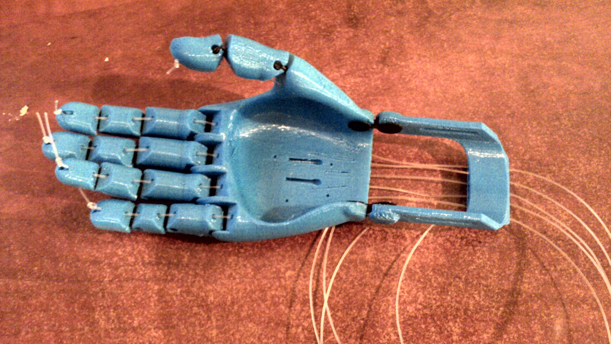

Motivation
=======

Why would you want to get into open source product design? 

The state of design today
------------------------------------

It seems like the only thing that worries designers these days is how to protect their work and their profits in a very conservative way. You've also heard many times someone comes with a supposedly good idea, someone else will promptly say "*− you should patent it!*", as if this was the only way to deal with your creativity.

If profit is the golden ratio of success stories and the prism through which design should be thought today, then this what we end up with:

#### Protection
What we learn in most design schools is all about protecting our work using patents and industrial design related rights (model and drawing deposits, etc.). There is also, of course, the default author's right applied to any _creation de l'esprit_ (intellectual creation), as the french call it. Patents and deposits have costs, are limited in time and limited by territory, unless you have almost infinite resources.

#### Obsolescence
> Obsolescence is the state of being which occurs when an object, service, or practice is no longer wanted even though it may still be in good working order. [Wikipedia]
Of which there is the now famous planned obsolescence with the sole intention of increasing sales volume and producing garbage.

#### Copy & anti-copy
> The concept of copying has a particular significance in certain areas of law. In each of the primary areas of intellectual property law, a number of cases have refined the question of what exactly constitutes the kind of copying prohibited by law, especially in areas such as copyright law.  
−[Wikipedia](https://en.wikipedia.org/wiki/Copying )

There is much debate around copying and its usually negative connotations. There is "illegal copies" which could harm you or the author, the dillusional control over copiers and the hypocricy of some education systems who tend to punish copying but ask students to recite what they have learned. Copy is also invariably associated with stealing, thanks to the entertainment industry, although those two are very different concepts.

### A "mental model" of design

#### A designer is an artist
A designer is a creator, an artist, who gets inspiration from a divine origin. Citation from the masters is authorized, but s/he should always come with something new and original.

#### Design localy, fabricate far away
Famous designers work like big brands, where their products are fabricated on the other side of the planet to limit costs and keep prices low for the end market while giving a comfortable margin for the producers.

#### Mass production
Design for manufacturing, where standard sizes are the norm and your products have to fit in predefined boxes. How fast can you get your product out and in what numbers? 

#### Design for the rich
Quality design is a luxury product. Only the rich can access it.

Design for humans
---------------------------
With open source product design, we're moving the whole design process back to the source: taking care of humans, every human.

We are looking for a generous creative attitude where we know that an artwork is inspired by nature and should respect it.

We allow ourselves to copy as a way to learn, encourage our creativity and iterate design processes.

We learn from traditions and existing designs, and do not try to reinvent the wheel every time.

We don't focus our designs on revenues but see it as a service for society. 

We choose the free/libre way because we can rely on a community for help, co-working and remixes.

We are not afraid of being copied.

We want a close relationship with our users, turn them into active contributors and get objective feedback.

We want to challenge the status quo and break social barriers.

We think of product design as a process, as communication, as information, and it wants to be free.

We know open source licensing is a key in upcycling and a legal framework for cradle to cradle thinking.

We don't have one size fits all so here's our files to make it fit for you.

We are not looking for perfection but know we have a better chance of acheiving it if we work together.

If you can't modify it, repair it or improve it, you don't own it and this makes us angry.

### Design together

Opting for a libre license ensures respect for author and the protection of its rights as author, while insuring visibility and dissemination.

Using libre licenses changes also the modes of production, conception and manufacturing of an object. Designer's work requires lots of skills and expertise. So a single object can take years to develop, requiring multiple skills. Often, several people contribute to the design of an object. Publishing an object using libre licenses opens the possibility of working with others, local or remote, using several consecutive publication-modification cycles.

Cosumers can appropriate the object, and make a different use of it or adapt it to their own needs. Even though this scenario could be desirable for everything, it is not true today. Usually objects have a label _Warranty void if manipulated by user or made an inappropriate use of it_. In the worst cases, there can be legal backlash too.

With open source product design, we reclaim the full ownership a buyer has over what s/he has acquired.

Ecodesign is an approach to designing product with special consideration for the environmental impacts of the product during its whole lifecycle. In a life cycle assessment, the life cycle of a product is usually divided into procurement, manufacture, use and disposal.https://en.wikipedia.org/wiki/Ecodesign
Thus environmental aspect is an important part of the project.
- Procurement: most of the open design projects use local materials.
- Manufacturing: The product is constructed on demand locally, you don't have to transport it from China to Europe, for exemple.
When a person chooses an open product, she is not a lambda customer.
She's more in a collaborative consumption and in a sharing economy than is less 
polluting system than productive consumption.

Tools
-------

Objects
-----------
### Open source stethoscope by Tarek Loubani
The bypass of Israel embargo on medical equipements in Gaza

> Tarek  Loubani, a Palestinian physician who works in Gaza and Canada,  discusses the Palestinian struggle to bring the benefits of modern (and sometimes not so modern) medical devices to the population of Gaza, consequently picking a free and open model for hardware and software  development that facilitates autonomy and collaboration with other   disenfranchised populations in the developing and developed worlds.
http://www.wired.co.uk/news/archive/2015-08/14/3d-printed-stethoscope-gaza

###  [Reprap](http://reprap.org/ )

 
 
Reprap project aims to create a self replicating machine. This project has grown steadily because most designs used libre licenses, allowing people from all over the world to contribute and improve them. Some of the most common printers are based on Prusa i2 and Prusa i3 designs. More on http://reprap.org/

### Prosthetic hands

 

Cut down the cost of medical equipment production by using libre designs. These prosthesis that can be extensively customized to fit children needs. Using digital fabrication tools, such as 3D printers, new pieces can be constructed to accomodate children growth with very low costs.

Food for thought
-----------------------

### Approved adaptations
The limit of derivation in the classic copyrigth in design. 
examples of allowed derivation > 
Original: le corbusier LC2, edited by Cassina) http://www.cassina.com/fr/collection/fauteuils-et-canapes/lc2 
Doshi Levien, edited by Moroso
(http://www.doshilevien.com/projects/chandigarh/
examples of similar design > 
Norman Foster vs Ikea
http://www.dezeen.com/2015/03/25/ikea-faces-legal-action-over-alleged-copyright-infringement-melltorp-dining-emeco-norman-foster-20-06-stacking-chair/

*La Société de consommation* Jean Baudrillard 
https://fr.wikipedia.org/wiki/La_Soci%C3%A9t%C3%A9_de_consommation_%28ouvrage%29

### Shaker movement
The shaker movement is a religious sect that had guiding principles of simplicity, utility and honesty. Their beliefs were reflected in the well-made furniture of minimalist designs.
The Shakers' dedication to hard work and perfection has resulted in a unique range of architecture, furniture and handicraft styles. They designed their furniture with care, believing that making something well was in itself, "an act of prayer." Before the late 19th century, they rarely fashioned items with elaborate details or extra decoration, but only made things for their intended uses. [...]
Early 19th-century Shaker interiors are characterized by an austerity and simplicity. The simple architecture of their homes, meeting houses, and barns have had a lasting influence on American architecture and design. 

https://en.wikipedia.org/wiki/Shakers#Architecture_and_furnishings
see also https://en.wikipedia.org/wiki/Shaker_furniture

### Victor Papanek
He was a designer and educator who became a strong advocate of the socially and ecologically responsible design of products, tools and community infrastructures. He disapproved of manufactured products that were unsafe, showy, maladapted or essentially useless. His products, writings and lectures were collectively considered an example and spur by many designers. Papanek was a philosopher of design and as such he was an untiring, eloquent promoter of design aims and approaches that would be sensitive to social and ecological considerations. He wrote that "design has become the most powerful tool with which man shapes his tools and environments (and, by extension, society and himself).
*Design for the Real World: Human Ecology and Social Change*
in french
http://issuu.com/pierrebv/docs/victor_papanek_-_design_pour_un_monde_r_el

### Jean Prouvé
Jean grew up surrounded by the ideals and energy of "l'École de Nancy," the art collective to which his father belonged. Its goals were to make art readily accessible, to forge links between art and industry, as well as between art and social consciousness.

The metal furniture of Jean Prouvé was produced copiously in every studio and workshop. His work involved frequent collaboration, most famously with Charlotte Perriand and Pierre Jeanneret.[16] The style is set apart from the Bauhaus steel furniture of the time by his rejection of the steel tube technique. Prouvé had more faith in the durability and form of sheet metal, "bent, pressed, compressed than welded". His designs speak of a work philosophy that includes knowledge of the materials at hand, a commitment to collaboration between artists and craftsmen, an attention to evolving technical developments, and "the principle of never postponing decisions so as neither to lose the impetus nor indulge in unrealistic forecasts". Prouvé was influential in the development of the idea of nomadic architecture, likening a chair to a house, and designing both with portability in mind.

His achievements in folded sheet (originally of lower costs and higher strength, like the bodywork of cars) include libraries, armcharrs, Anthony beds, desks and Compass tables. These pieces are exemplary and are quoted as the highest in design for 20th century. An original edition of Anthony chair is worth 40.000 EUR; a Kangaroo chair was sold for 152.449 EUR in March 2011; a library could be valued at over 160.000 EUR)

### Art and design
[Carpenters Workshop Gallery](http://carpentersworkshopgallery.com)
"When we started out, less than a decade ago, there was little  connection between art and design. Since then, things have changed so  much. We are pleased to see that now there are designers who no longer do industrial design; they are creating a new kind of discipline that is  closer to art", - says Julien Lombrail about the concept of the gallery.
It's the art market create that kind of design. The price of the pieces are very huge, just an elite can buy it. And the "Designer" now called "artist" became stars.

### Enzo Mari
Enzo Mari is a noted Italian modernist artist and furniture designer.
He is famous for his *Autoprogettazione* manual. 

*The 19 ‘Do-It-Yourself’ furniture designs, which the Italian Designer Enzo Mari published in his book ‘Autoprogettazione’ in 1974, marks a milestone in the comtemporary design history. Positioned in contrast to the formalism at the time, Enzo Mari suggests the democratisation of design and creating a provoking alternative to the capitalist paradigm of mass consumption. Building your own furniture, when required, that’s the idea.* Also that project born in 1974 just after the first oil crisis in 1973. The poverty in Italy and all Europe was huge, Enzo Mari by this project, show that problem and give an social design answer.
http://www.cucula.org/en/enzo-mari/
[book ‘Autoprogettazione’pdf](http://www.matthewlangley.com/blog/Enzo-Mari-Autoprogettazione2.pdf)

### Gerrit Rietveld
Rietveld was a Dutch furniture designer and architect. One of the principal members of the dutch artistic movement called *De Stijl*. Piet Mondrian is the most famous figure from that movememt. Rietveld is famous for his Red and Blue Chair and for the Rietveld Schröder House.

About Crate series:
The original “Krat” (Crate) furniture was produced using untreated red spruce normally reserved for packing cases. It was sold in a kit form, to be assembled at home by the purchaser. The Crate furniture was a response to the economic crisis of the 1930s. It offered useful, inexpensive seating with basic construction and cheap materials. Other items of 'Crate' furniture include a Crate easy chair, Crate table, Crate desk, Crate bookcase and a Crate stool, all from 1934.
http://www.annetgelink.com/l/artists/4-ryan-gander/works/other-works/11647/
How to construct Rietveld furniture documents the best known and most typical furniture designs by Gerrit Rietveld down the smallest detail. The book contains working plans, measurements, detail drawings, lists of materials and instructions for the assembly of each piece, as well as historical information about each one.
[how to construct rietveld furniture](http://www.copyrightbookshop.be/en/books/details/1038/0)

### Bernard Stiegler
Bernard Stiegler is a french philosopher and head of the Institut de recherche et d'innovation (IRI), which he founded in 2006 at the Centre Georges-Pompidou. He is also the founder in 2005 of the political and cultural group, Ars Industrialis, and the founder in 2010 of the philosophy school, pharmakon.fr*

His key themes are technology, time, individuation, consumerism, consumer capitalism, technological convergence, digitization, americanization, education and the future of politics and human society

talk about the figure of "amateur"
in french:[URL Ars Industrialis](http://arsindustrialis.org/node/1848)
[URL youtube](https://www.youtube.com/watch?v=EIsDStewTwU)

### Thomas Chippendale
Thomas Chippendale was a London cabinet-maker and furniture designer in the mid-Georgian, English Rococo, and Neoclassical styles. In 1754, he published a book of his designs titled *The Gentleman and Cabinet Maker's Director*. The designs are regarded as reflecting the current London fashion for furniture for that period and were used by other cabinet makers outside London.
*The Gentleman and Cabinet Maker's Director*
[URL book](http://digital.library.wisc.edu/1711.dl/DLDecArts.ChippGentCab )

Open questions
-----------------------

#### Design and technology
Designers are always excited about the latest technology. Design for the third industrial revolution or with the latest materials from NASA. But what are we designing for?

